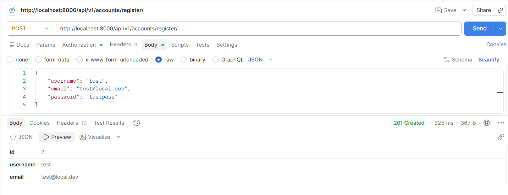
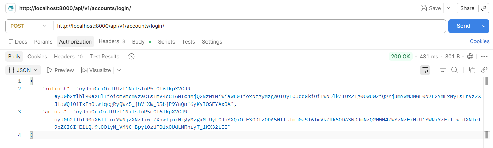
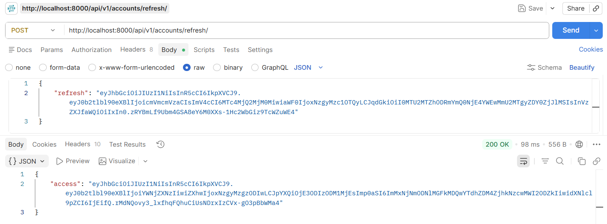
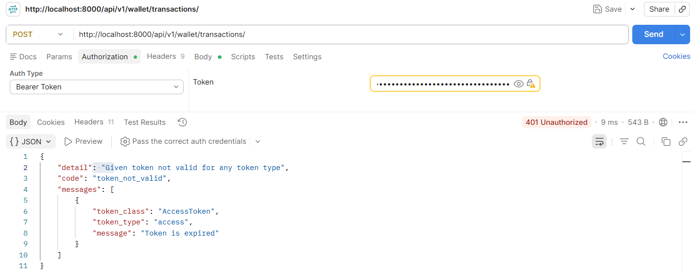
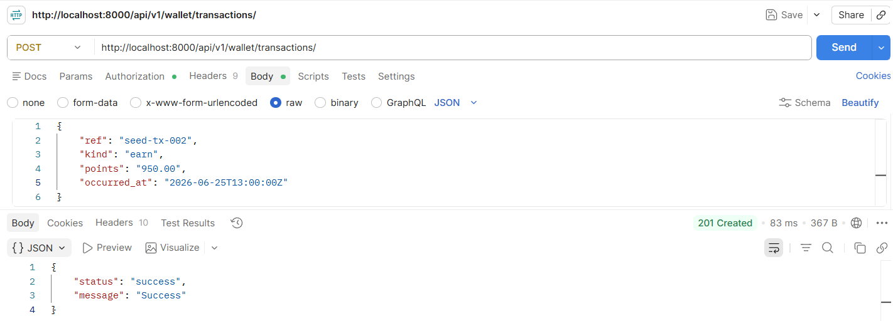
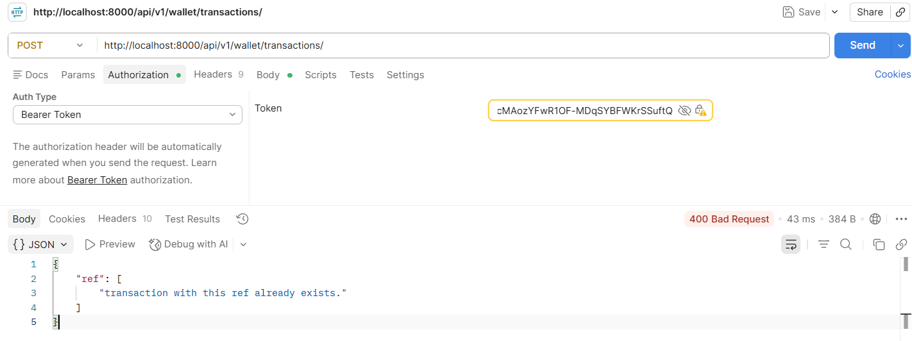
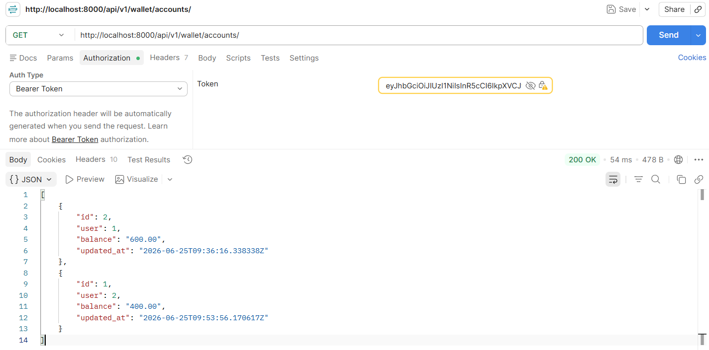
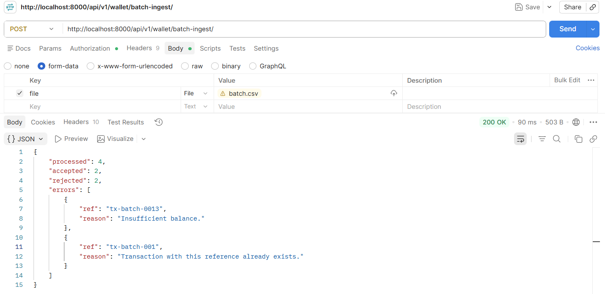

<p align="center">
  
</p>

# SFTX: Loyalty Points Wallet

## Overview
A robust, thread-safe microservice for managing user loyalty point balances, featuring atomic transaction processing, idempotency, and batch CSV ingestion.

## Setup & Deployment
1. **Environment**: Copy `.env.example` to `.env`.
2. **Launch**: `docker-compose up --build`
3. **Database Setup**: 
   - `docker-compose exec api python manage.py migrate`
   - `docker-compose exec api python manage.py createsuperuser`
4. **Access**: API is live at `http://localhost:8000`.

## Testing
We utilize Django’s `APITestCase` to ensure high reliability across our service and view layers. To run the full test suite:

```bash
# Execute tests for both wallet and accounts apps
docker compose exec api python manage.py test apps/wallet apps/accounts
```

### What is covered:

* **Wallet Concurrency**: Ensures atomic transactions and correct balance handling.

* **Account Auto-provisioning**: Verifies that new users automatically receive a wallet via `post_save` signals.

* **Authorization**: Confirms that members can only access their own data and that batch ingestion is restricted to admins.

* **Error Handling**: Validates rejection of duplicate references and insufficient fund attempts.

## Manual Testing Workflow (Postman)

### 1. User Onboarding & Auth
* **Register Member**: `POST /api/v1/accounts/register/` — Creates a user and triggers the signal to auto-provision a wallet.
  * Please note that we leverage Django's `createsuperuser` to create the admin user/permission. This endpoint is solely for the normal user type.

* **Authenticate**: `POST /api/v1/accounts/login/` — Retrieve `access` and `refresh` JWT tokens.

### 2. Wallet Operations
* **View Balance**: `GET /api/v1/wallet/accounts/` — Confirms the account exists and displays current points.

* **Execute Transaction**: `POST /api/v1/wallet/transactions/`

* Use `kind: "earn"` to increase balance.

* Use `kind: "spend"` to decrease balance (enforces business rules like insufficient funds).

* **Integrity Check**: Re-submit the same `ref` to verify the system rejects duplicates.

### 3. Batch Ingestion
* **Process CSV**: `POST /api/v1/wallet/batch-ingest/`

    * **Auth**: Use an Admin token.

    * **Format**: `multipart/form-data` with `file` as the key.

    * **Validation**:

        * Verify that successful rows update the balance.

        * Verify that invalid rows (e.g., duplicate references, insufficient funds) are reported in the JSON summary response without halting the entire batch.

## System Architecture

For a detailed breakdown of our architectural decisions, concurrency strategies, and security design, see [solution.md](SOLUTION.md).

---

### Key Improvements Made:
* **Centralized Test Command**: Clear instructions on how to execute the full suite using the `docker compose` service.
* **Testing Scope Definition**: Explicitly listed the logic being covered (Signals, Concurrency, Authorization), which helps future developers understand *why* these tests exist.

## Postman Screens

Member Account Registration:
<p>
  
</p>

User Login:
<p>
  
</p>

Token Refresh:
<p>
  
  
</p>

Create Transaction:
<p>
  
  
</p>

See Wallet Balance (Admin):
<p>
  
</p>

Batch Ingestion:
<p>
  
</p>